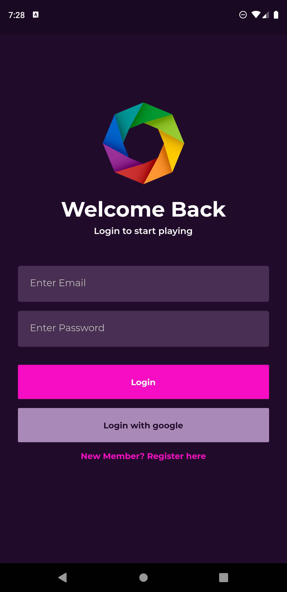
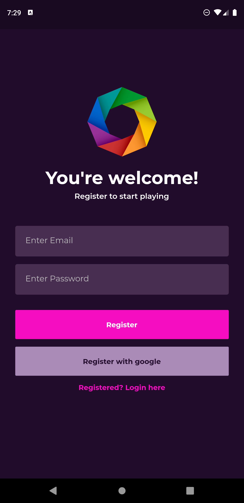
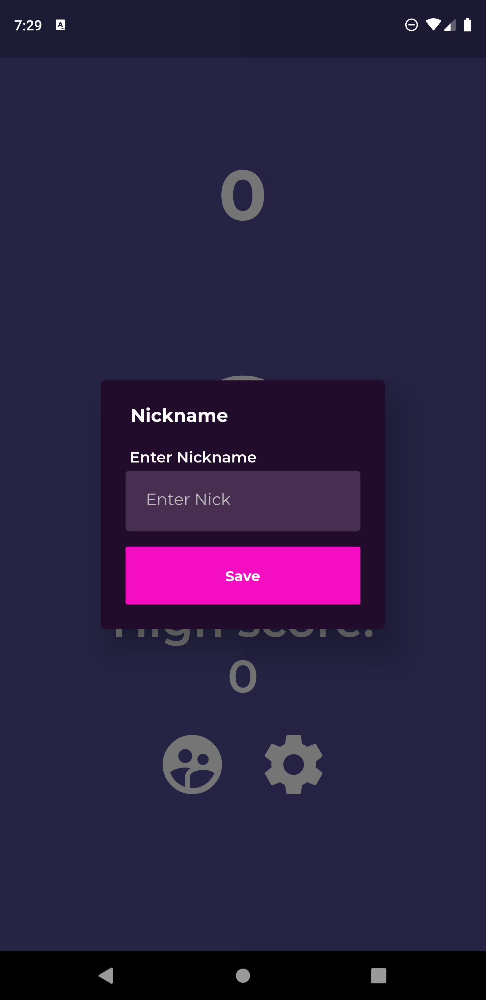
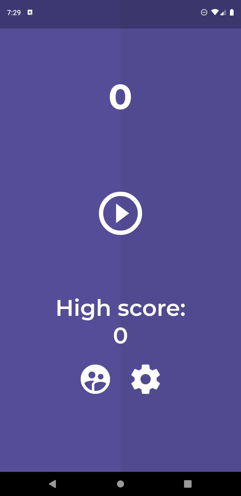
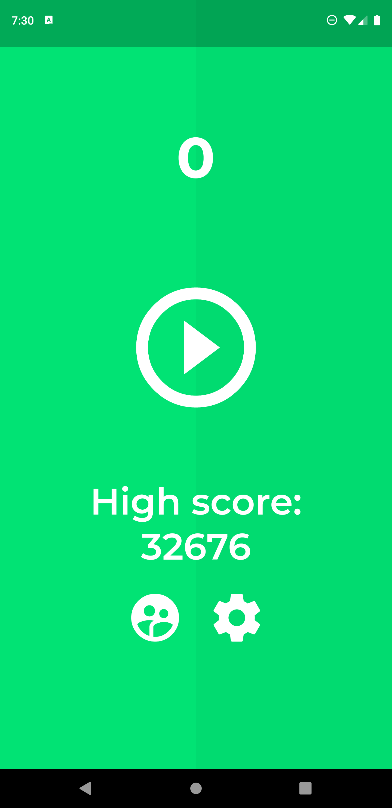
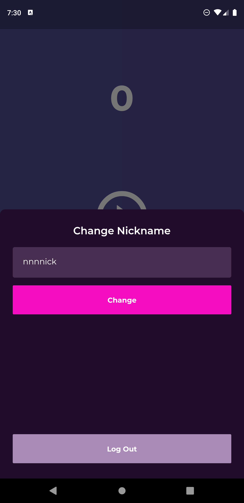
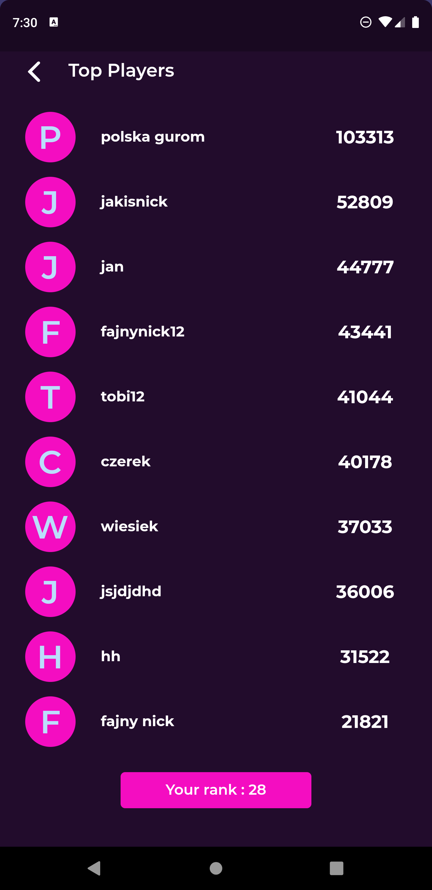
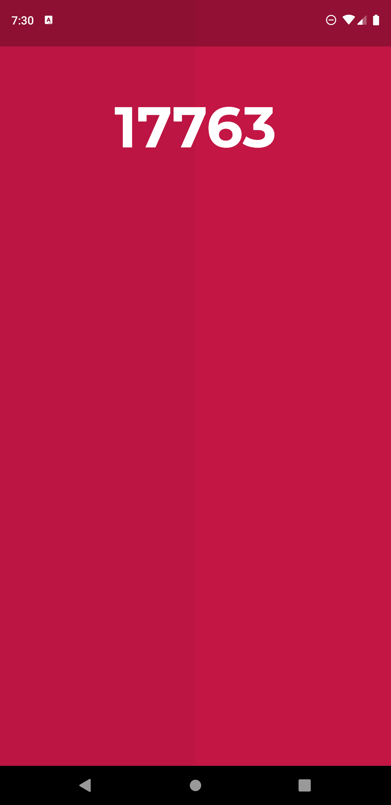
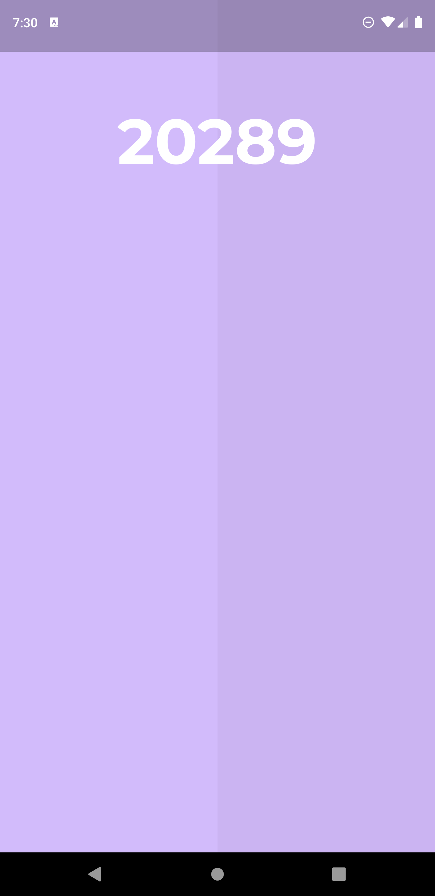
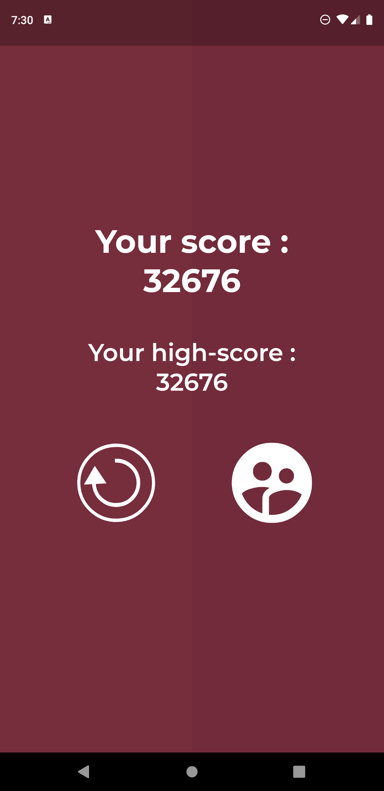

# Color Game
# Simple Colors Game in Flutter

A new Flutter application.

## Getting Started

This project is a starting point for a Flutter application.

A few resources to get you started if this is your first Flutter project:
#### Used features:
- flutter material design library
- flutter firebase auth library [link](https://pub.dev/packages/firebase_auth)
- flutter google sign in library [link](https://pub.dev/packages/google_sign_in)
- flutter provider library [link](https://pub.dev/packages/provider)
- flutter progress dialog library [link](https://pub.dev/packages/progress_dialog)
- flutter cupertino icons library [link](https://pub.dev/packages/cupertino_icons)
- flutter cloud firestore library [link](https://pub.dev/packages/cloud_firestore)
- flutter shared preferences library [link](https://pub.dev/packages/shared_preferences)

A few resources to get you started if this is your first Flutter project:
- [Lab: Write your first Flutter app](https://flutter.dev/docs/get-started/codelab)
- [Cookbook: Useful Flutter samples](https://flutter.dev/docs/cookbook)

For help getting started with Flutter, view our
[online documentation](https://flutter.dev/docs), which offers tutorials,
samples, guidance on mobile development, and a full API reference.

#### Used technology
- async tasks
- build listview with builder method
- use maps and lists
- custom classes and widgets
- authenticate with email and password
- authenticate with google account
- save data to firestore
- using forms, dialogs, input decorations
- using bottom sheets
- save data to shared preferences

## Screenshots :

## Thanks for reading. Don't forget to star my project